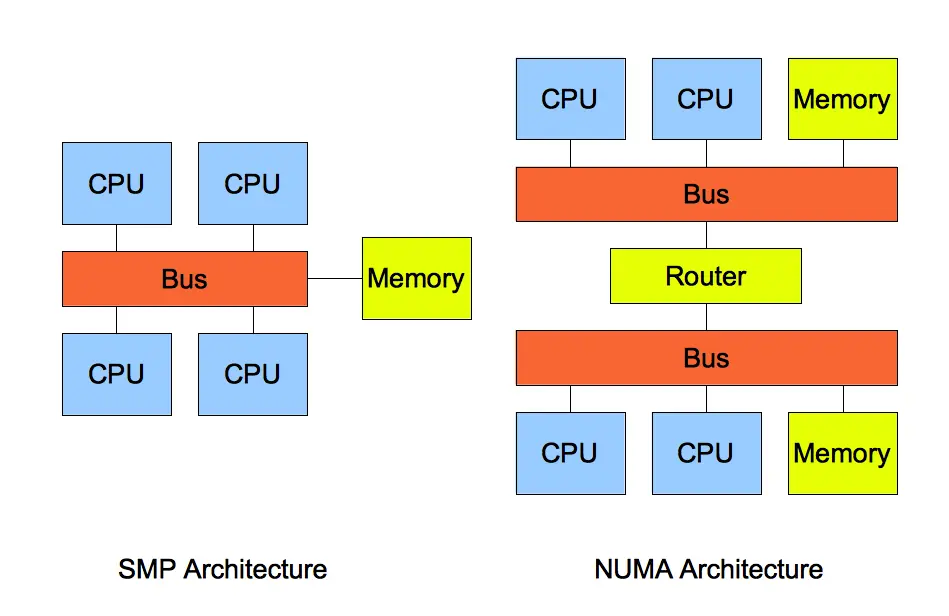

# 系统结构 #

## 二、硬件结构 ##

**冯诺依曼模型**：运算器、控制器、存储器、输入设备、输出设备

**中央处理器**：包括寄存器、控制单元和逻辑运算单元

寄存器种类

- 通用寄存器 => 运算数据
- 程序计数器 => 下一条指令“所在的内存地址”
- 指令寄存器 => 正在执行的指令

**总线**：包括地址总线、数据总线和控制总线

**CPU执行过程**

1. 读取“程序计数器”，获得指令的内存地址，通过“地址总线”访问内存，将准备好的数据通过“数据总线”传输给CPU，存储到“指令寄存器”
2. “程序计数器”自增，指向下一条指令。32位的CPU指令占用4个字节，因此PC+4
3. CPU分析指令，将计算类型的指令交给“逻辑运算单元”运算，将存储类型的指令交给“控制单元”执行

### 指令 ###

MIPS指令是32位，高6位表示操作码，剩下根据类型不同表示含义不同，主要分为R、I和J型指令

- **R指令**: 算数和逻辑运算，包含读取和写入数据的寄存器地址；如果是逻辑位移操作，后面又位移量，功能码则对应前面操作码不够用的时候，拓展 操作码表示具体的指令
- **I指令**：用于数据传输、条件分支，第三部分使用地址或常数
- **J指令**：跳转指令，263位表示跳转的地址

**指令周期**

1. 取指令
2. 指令译码
3. 执行指令
4. 数据回写

**指令类型**

1. 数据传输：store/load，Mov
2. 运算指令
3. 跳转指令
4. 信号指令：中断指令trap
5. 闲置指令：nop

**指令执行速度**

**程序CPU执行时间=CPU时钟周期数x时钟周期时间**

进一步推导得到：

**程序CPU执行时间=指令数x每条指令的时钟周期数（CPI）x时钟周期时间**

### 存储器 ###

1. 寄存器
2. 缓存：程序CPU执行时间=CPU时钟周期数x时钟周期时间，L1 Cache 通常会分为「数据缓存」和「指令缓存」
3. 内存
4. 硬盘

### CPU Cache ###

CPU访问数据时，如果Cache没有数据则会从内存读取，但并不是只读取一个数据，而是一次读取一块数据到Cache，采用直接映射，将内存地址差分为“索引+组标记+偏移量”

要想写出让CPU跑得更块的代码，要提升缓存命中率：

1. 数据缓存，按照内存布局进行顺序操作
2. 指令缓存，有规律的分支语句能让CPU的分支预测更好发挥作用

#### 数据写入 ####

**写直达**

1. 如果数据在Cache中，先更新Cache，在写入内存
2. 如果数据不在Cache中，直接写入内存

如论如何都要写回内存

**写回**

发生写操作时，新的数据仅仅写入Cache中，只有当被修改过的Cache被替换时才需要写回内存

1. 写操作时，数据在Cache中，则更新Cache，标记为dirty
2. 写操作时，对饮的Cache存放的识别的地址的数据的话，检查是否为diery，如果为dirty需要将当前数据写回内存，然后再将要写入的数据读取到Cache中，修改并标记为dirty；如果不是dirty，直接再将要写入的数据读取到Cache中，修改并标记为dirty

#### 缓存一致性 ####

原因：L1/L2 Cache是CPU核心各自独有的

解决这个问题需要考虑两点：

1. **写传播**：某个CPU核心更新Cache时，必须传播到给其他核心 => **总线嗅探**：通过总线广播事件给其他核心
2. **事务串行性**：核心对数据的操作顺序，必须在其他核心看来顺序一致 => **MESI协议**

**MESI协议**

> [https://xiaolincoding.com/os/1_hardware/cpu_mesi.html#mesi-协议](https://xiaolincoding.com/os/1_hardware/cpu_mesi.html#mesi-%E5%8D%8F%E8%AE%AE)

- Modified（已修改）：dirty数据
- Exclusive（独占）：干净的，只有一个核心持有该数据
- Shared（共享）：干净的，多个核心持有该数据
- Invalidated（已失效）：不可以读取的数据

#### 伪共享问题 ####

**伪共享**：两个数据的地址在物理内存上连续，但是分属于两个CPU核心，由于Cache Line的机制，会被两个核心读取到Cache中

如何避免伪共享呢 => 内核提供了相关的宏定义

### CPU如何选择线程 ###

Linux内核中调度的对象是`task_struct`，统称为任务。进程和线程都是通过任务表示，区别是线程的如任务中共享了进程创建的资源

任务有一个游侠三年级，0-99表示实时任务，100-139表示普通任务

**调度器**

调度类 | 调度器 | 调度策略 | 运行队列 | 备注
--- | --- | --- | --- | ---
Deadline | Deadline调度器 | SCHED_DEADLINE | dl_rq | 实时任务，距离当前时间点最近的
Realtime | RT调度器 | SCHED_FIFO/SCHED_RR | rt_rq | 实时任务，先到先服务/时间片轮转
Fair | CSF调度器 | SCHED_NORMAL/SCHED_BATCH | csf_rq | 普通任务，普通/后台任务调度

CSF：完全公平调度，会优先选择vruntime少的任务，保证每个任务的vruntime尽可能相等

**CPU队列**

CPU运行着上面三个队列，有限从dl和rt队列中选择，也就是实时任务总是会比普通任务优先执行，csf队列使用红黑树实现

### 中断 ###

**中断**：系统响应硬件设备请求的机制，接收到中断请求，会打断正在执行的进程，使用中断处理程序响应请求

#### 软中断 ####

**软中断**：为了解决中断处理程序执行时间长和中断丢失的问题，将中断过程分为两个阶段：

- 上半部：快速处理中断；直接处理硬件请求，也就是硬中断
- 下半部：延迟处理未完成的工作；由内核触发，也就是软中断

    watch -d cat /proc/softirqs # 查看中断次数变化率

### 算数运算 ###

**十进制转二进制** 

- 整数部分除2取余法
- 小数部分乘2取整法

并不能精准表示所有小数，有些只能使用近似值

二进制转十进制，小数点后面的指数幂是负数

**补码**：把正数的二进制全部取反在加1

1的二进制：0 0000000000000000000000000000001 => 1 1111111111111111111111111111110 => 1 1111111111111111111111111111111(-1的补码)

**为什么负数要使用补码表示？**

不使用补码的话，-2+1=-3，需要特殊处理正负号

**如何存储小数**

1000.101 => 1.000101x2^3 => 000101&3（尾数和指数）

IEEE标准：符号位+指数位（决定可以表达的范围）+尾数（决定精度）

单精度浮点数（float）：1+8+23

双精度浮点数（double）：1+11+52

10.625 => 1010.101 => 1.010101x2^3 => 0 10000010(127+指数) 01010100000000000000000（后面填充0）

## 操作系统结构 ##

**内核基本能力**

1. 进程/线程管理
2. 内存管理
3. 硬件管理
4. 提供系统调用

**Linux设计**

1. 多任务：并发（单内核）和并行（多内核）
2. 对称多处理（SMP）：每个CPU地位相等，对资源使用权限也相同
3. ELF：可执行文件连接格式，Program header table记录了运行时所需的段，Section header table记录了二进制文件各个“段的首地址”
4. 宏内核：Monolithic Kernel，系统中所有的模块，如系统调用、内存管理、文件管理、设备驱动等都运行在内核态

**Window设计**

混合内型内核 + PE可执行文件

## 内存管理 ##

> 关键章节

### 内存分段 ###

段选择因子和段内偏移量

根据段选择因子中的段号从段表中查询段基地址，再加上段内偏移量得到物理地址

会出现外部内存碎片，使用内存交换来解决，先将内存数据写回到硬盘然后再读回内存，连续装载

### 内存分页 ###

把虚拟内存和物理内存切成一段段固定尺寸的大小

**内存地址转换**

1. 虚拟地址切分为页号和偏移量
2. 根据页号从页表查询对应的物理页号
3. 物理页号+偏移量

页表会变得非常大，因此需要多级页表

如果二级页表都存在的话依然会占用更多内存，但是根据局部性原理，二级页面不一定被用到，也就不用创建对应的二级页表了

**快表TLB**

虽然多级页表解决了空间问题，但是带来了更多的内存访问，增加时间开销

因此将经常访问的页表存放在页表想的Cache中

### 段页式内存管理 ###

先将程序划分为多个有逻辑意义的段，在将每个段分页，结构由段号、段内页号和业内位移三部分组成

三次内存访问

1. 访问段表，得到页表起始地址
2. 访问页表，得到物理页号
3. 物理页号加页内位移

### Linux内存布局 ###

inter cpu采用段式将逻辑映射为线性地址，再由页式映射到物理地址

Linux主要采用页式内存管理，同时也不可避免段机制，将每个段映射到整个内存空间中

内存分为内核空间和用户空间

用户内存中包括

1. 代码段
2. 数据段：初始化的静态变量和全局变量
3. BSS段：未初始化的静态变量和全局变量
4. 堆段，动态分配的内存，从低向上增长
5. 文件映射段，动态库、共享内存等，从低向上增长
6. 栈段，局部变量和函数调用的上下文，大小固定8MB，从高向下增长

**为什么要使用虚拟内存**

1. 可以是用超过物理内存的运行内存
2. 进程虚拟内存相互独立
3. 页表除了物理地址外，还有标志位，如读写权限，提供更好的安全性

### malloc分配内存 ###

方式一：通过brk()系统调用从堆分配，堆顶指针想高地址移动，要分配的内存小于128KB；free释放的时候，并不会把内存返还，而是缓存在内存池中，下次使用

方式二：通过mmap()系统调用在文件应摄取分配，要分配的内存大于128KB；free释放的时候，回归还，真正释放

malloc分配的是虚拟内存，没有被访问的话不占用物理内存，访问的时候，查询页表发生缺页中断

mmap分配内存的时候不仅发生运行态切换，还会发生缺页中断（第一次访问虚拟地址），开销比brk大，因为brk分配的内存不会真正释放；但是brk也会产生越来越多不可用的碎片，造成内存泄露

malloc返回的内存起始地址比进程中对空间的地址多了16字节，用于保存这块内存的描述信息，包括内存块的大小

### 内存回收 ###

申请物理内存 => 虚拟内存 => 访问 => 缺页中断 => 内存不足 => 内存回收

三级内存回收：

1. 后台内存回收：kswapd内核线程回收内存，异步处理
2. 直接内存回收：后台异步回收跟不上，开启直接回收，同步的，会阻塞进程
3. 依然无法满足，触发OOM（Out of Memory）机制

哪些内存可以回收：

1. 文件页：内核缓存的磁盘数据和文件数据叫做文件页，直接回收干净页，回收脏页需要先写回磁盘在释放
2. 匿名页L没有实际的载体，如堆栈数据，通过Linux的swap机制把不常用的内存先写到硬盘

基于LRU算法回收不常用的内存，维护active和inactive两个双向链表

回收内存带来的性能影响：直接回收会阻塞进程；文件页回收需要写脏数据、匿名页回收会发生磁盘IO，影响性能，匿名页影响更大

内核定义了三个内存阈值，衡量剩余内存是否充裕：

1. 页最小阈值
2. 页低阈值
3. 页高阈值

剩余内存处于不同的位置时，对应的操作

直接内存回收 < 最小阈值 < 使用kswapd进行回收内存 < 页低阈值 < 内存分配正常 < 页高阈值 < 内存充足

**NUMA框架**

**SMP**架构指多个CPU共享资源，地位平等，这样的内存成为一致性存储访问（UMA）

**NUMA**指非一致性存储访问，对CPU进行分组，分组通过互联模块总线进行通信，某一个分组内存不足时，可以从其他分组寻找空闲内存，也可以本地回收内存

四种回收模式：

1. 本地回收钱，在其他寻找空闲内存（默认）
2. 只本地回收
3. 本地回收，可以写回脏页
4. 本地回收，可以swap回收内存

**Out of Memory(OOM)**

系统内存不足时，申请大块内存，会触发OOM机制，扫描系统中可以被杀掉的进程，计算得分，杀掉得分最高的进程

	points = process_pages + oom_score * totalpages / 1000

可以看出得分依赖于进程使用的物理内存页数和每个进程的OOM校准值，重要进程oom_score设置为-1000，避免被杀掉

### 申请超过物理内存的空间 ###

32为的操作系统最大申请3GB空间

swap机制的存在使得应用程序可以申请远超过物理内存的空间

硬盘swap分区

### 预读失效和缓存污染 ###

基于LRU的内存替换策略，将经常被访问的数据缓存到内存中，通常基于链表实现

- 访问的页在内存中，将其移动到链表的头部
- 不在内存中，将该页放到链表的头部，淘汰尾部的页

**LRU面临的问题**

1. 预读失效导致缓存命中率下降
2. 缓存污染导致缓存命中率下降

**预读失效**

根据空间局部性原理，程序访问数据时，会选择附近的数据一起读入到内存中，下次访问后面的数据时，就不需要读磁盘了

但是如果提前加载的页没有访问，就是预读失效，他们会占用LRU前排的位置，淘汰末尾页，可能淘汰热点数据

为了避免上面的问题，要让预读的页在内存中停留的时间尽可能短，因此将LRU分为active list和inactive list（Mysql则是young和old）

将预读页放到inactive lsit头部，被访问到在加入到active list头部，将active list淘汰的页加入到inactive list头部

对于Mysql的young和old则是有一条链表构成，young淘汰的页会被自动挤到old区域

**缓存污染**

大量只被访问一次的数据被放到active list头部，淘汰了热点数据，再次访问热点数据时，产生大量IO

考虑到进入active list的门槛太低了，提高门槛

解决方案：第一次访问时加入到inactive list中，在内存页被第二次访问时才会从加入到active list中

还考虑两次访问的时间间隔，如果在1s内则不会提升，超过1s的两次访问才会加入active list

### TODO：[深入理解Linux虚拟内存管理](https://xiaolincoding.com/os/3_memory/linux_mem.html) ###

### Linux物理地址 ###

32位虚拟地址：页目录项（10）+页表项（10）+页内偏移（12）

64位虚拟地址：全局页目录项（9）+上层页目录项（9）+中间页目录项（9）+页表项（9）+页内偏移（12）

#### 物理内存模型 ####

Page Frame Number => PFN

page_to_pfn和pfn_to_page的计算

**FLATMEN平坦内存模型**

物理内存连续，划分的物理页也连续，所以可以直接加减运算

物理内存存在空洞，那么分配的struct page浪费

**DISCONTIGMEM非连续内存模型**

宏观上将物理内存划分为node，每个node管理一块连续的物理内存，每个node还是采用平坦模型管理，从而避免空洞

需要多计算一步定位page所在node

**SPARSEMEM稀疏内存模型**

内存支持热插拔，物理内存不连续成为常态，所以每个node中的物理内存也不一定连续

因为每个node中有完整的内存管理系统，如果node太多，开销就很大

稀疏内存模型就是对粒度更小的连续内存进行精细管理，单元成为section，页大小为4K的情况下，section为128M

将mem_section房子啊全局数据中，支持offline/online

**热插拔**

拔出时需要将已经分配的物理页乔伊到其他的mem_section内存上，考虑到内核空间的DMA和NORMAL映射区与物理内存时直接映射关系，这部分无法迁移，因此不会讲这部分页分配到可能被拔出的内存中

## 进程管理 ##

并发与并行

### 进程状态 ###

1. 运行状态：占用CPU
2. 就绪状态：其他进程占用CPU
3. 阻塞状态：等待某一时间发生而暂停运行
4. 创建状态
5. 结束状态

根据挂起进程是否占用物理内存，分为就绪挂起状态和阻塞挂起状态（进程在外存）

### 进程控制结构 ###

进程控制块（process control block, PCB）————进程存在的唯一标识

1. 进程标识符：唯一
2. 用户标识符：归属的用户，用于共享和保护服务
3. 进程当前状态：上面五个状态
4. 进程优先级
5. 资源分配清单：内存地址空间和虚拟地址空间的信息，所打开的文件列表和使用的IO设备
6. CPU信息：CPU中计算器的只，进程切换时，CPU的状态都因该保存在PCB中，方便重新执行

通过链表组织，将相同状态的进程连接在一起，组成队列

### 进程控制 ###

**创建进程**

子进程可以继承父进程所拥有的资源

1. 申请空白PCB，填写控制和管理进程的信息，如标识符
2. 分配必须的资源，如内存资源
3. 将PCB插入就绪队列

**终止进程**

正常结束、异常结束、外界干预

kill子进程，返还继承的资源给父进程；kill父进程，子进程成为孤儿进程，有1号进程收养

1. 找到对应PCB
2. 处于执行状态，立刻终止，将CPU资源分配给其他进程
3. 子进程交给1号进程
4. 返还全部资源给OS
5. 从PCB队列删除

**阻塞进程**

1. 找到对应PCB
2. 如果处于运行状态，保护线程，阻塞
3. PCB插入阻塞队列

**唤醒进程**

1. 找到对应PCB
2. 从阻塞队列移出，改为就绪状态
3. 插入就绪队列，等待调度

**CPU上下文**：CPU寄存器和程序计数器

**进程切换发生场景**

开销很重要

1. 进程分配的时间片耗尽
2. 系统资源不足
3. sleep函数主动挂起
4. 优先级更高的进程插入
5. 硬件中断

### 线程 ###

线程是进程中的一条执行流程，同一进程中线程共享代码段、数据段和打开的文件资源，但有独立的寄存器和栈

- 优点：一个进程多个线程、并发、共享地址空间和文件资源
- 缺点：进程中一个线程崩溃导致所属进程的所有线程崩溃

进程 | 线程
--- | ---
资源分配单位 | CPU调度单位
拥有完整的资源平台 | 独享必不可少的资源
状态转换 | 同样的状态转换
开销大 | 减少并发执行的时空开销

**开销**

1. 线程创建快，不涉及资源管理
2. 线程终止快，释放的资源少
3. 线程切换快，线程有相同的地址空间，意味着公用同一个页表
4. 线程之间数据传递快

**线程实现**

- 用户线程
- 内核线程
- 轻量级线程：在内核中支持用户线程

TODB：各自的优缺点

### 调度 ###

- 非抢占式调度算法：等到当前进程被阻塞或退出，才会调用另外的进程，不管时钟中断
- 抢占式调度算法：处理时钟中断

**调度原则**

1. **提高CPU利用率**，发生IO造成CPU空闲
2. **提高吞吐率**，权衡长任务和段任务
3. **周转时间**=运行时间+等待时间，考虑等待时间和运行时间的关系
4. 在就绪队列中**等待的时间**
5. 交互式强的应用，考虑**响应时间**

### 调度算法 ###

#### 先来先服务（FCFS） ####

不利于短作业，适用于CPU繁忙系统，不适用于IO繁忙系统

#### 最短作业优先（SJF） ####

对长作业不利，饥饿

#### 高相应比优先（HRRN） ####

优先权=（等待时间+要求服务时间）/要求服务时间

#### 时间片轮转调度（RR） ####

最古老、简单、公平的

为每个进程分配一段时间片，时间片的长度设置为20-50没ms，太短导致过多上下文切换，太长对短作业响应变长

#### 最高优先级调度（HPF） ####

- 静态优先级：创建时确定优先级，不再改变
- 动态优先级：进程运行时间增加，降低优先级；等待时间增加，提升优先级

- 非抢占
- 抢占

优先级低的作业饥饿

#### 多级反馈队列电镀（Mutilevel Feedback Queue） ####

- 设置多个队列，每个队列不同的优先级，优先级从高到低，优先级越高时间片越短
- 新进程被加入到第一队列末尾，按照FCFS调度；如果第一级队列规定的时间没运行完场，转入第二队列末尾
- 优先级高的队列为空时，才会调度优先级低的队列。新进程进入较高优先级队列后，停止当前进程并放入原队列末尾，让高优先级进程运行

短作业在第一队列完成，长作业移入后面的队列，兼顾长短作业

## 进程间通信 ##

进程的用户地址空间独立，不能互相访问，但是内核空间贡献，所以**进程通信必须通过内核**

### 管道 ###

匿名管道是只能用于存在父子关系的进程间通信

管道是单向的，先进先出

效率低，不适合频繁的数据交换

### 消息队列 ###

A给B发消息，A将数据放到对应的消息队列

通信不及时，附件有大小限制，存在用户态和内核态之间数据拷贝开销

### 共享内存 ###

拿出一块虚拟地址空间，映射到相同的物理内存

同时修改同一个共享内存会发生冲突

### 信号量 ###

整数，实现进程同步和互斥

- P操作：信号量减1，如果小于0，表明资源被占用，阻塞等待；如果大于等于1，有资源可用
- V操作：信号量加1，如果小于等于0，表明有阻塞的京城，将其唤醒；如果大于0，没有阻塞的进程

既可以用于互斥信号量，也可以用于同步信号量

### 信号 ###

异常情况下的工作模式，需要使用信号的方式来通知进程，跟信号量完全没关系

如 ctrl+c 产生SIGINT信号，终止进程， ctrl+z产生SIGTSTP信号，表示停止该进程，但未结束 kill -9产生SIGKILL

信号是进程间通信机制中唯一的异步通信机制，可能执行三种操作

1. 执行默认操作
2. 捕捉信号：定义信号处理函数，当信号发生时，执行相应的函数
3. 忽略信号：忽略某些信号

### Socket ###

跨网络与不同主机上的进程通信

	int socket(int domain, int type, int protocal)

- domain：协议族，AF_INET用于IPV4，AF_INET6用于IPV6，AF_LOCAL/AF_UNIX用于本机
- type：通信特性，SOCK_STREAM表示字节流，对应TCP，SOCK_DGRAM表示数据包，对应UDP，SOCK_RAW表示原始套接字
- protocal：废弃

实现 TCP 字节流通信： socket 类型是 AF_INET 和 SOCK_STREAM；
实现 UDP 数据报通信：socket 类型是 AF_INET 和 SOCK_DGRAM；
实现本地进程间通信： 「本地字节流 socket 」类型是 AF_LOCAL 和 SOCK_STREAM，「本地数据报 socket 」类型是 AF_LOCAL 和 SOCK_DGRAM

## 多线程冲突 ##

### 互斥与同步 ###

多线程执行操作共享变量的这段代码造成竞争状态，这段代码叫做**临界区**，不能给多线程同时执行，叫做**互斥**

并发进程/线程可能需要互相等待与互通消息，叫做**线程同步**

### 互斥同步的使用和实现 ###

#### 锁 ####

加锁和解锁可以解决并发线程/进程的互斥问题

进入临界区前加锁，完成访问后解锁

忙等待锁，获取不到锁时候一直自旋

原子操作指令————Test-and-Set

	int TestAndSet(int *old_ptr, int new) {
		int old = *old_ptr;
		*old_ptr = new;
		return old;
	}

要不全部执行，要不都不执行，不可能执行到一半的中间状态，使用如下
	
	while(TestAndSet(lock, 1) == 1)

无忙等待锁，获取不到锁，将线程放入到锁的等待队列

#### 信号量 ####

P操作和V操作

#### 生产者和消费者问题 ####

- 生产生生成输入放入缓冲区
- 消费者从缓冲区取出局
- 只能有一个生产者或消费者可以访问缓冲区

缓冲区**互斥**访问，生产者和消费者需要**同步**

需要三个信号量：

1. 互斥信号量mutex：互斥访问缓冲区
2. 资源信号量fullBuffers：消费者询问是否有数据，初始为0
3. 资源信号量emptyBuffers：生产者询问是否有空位，初始为n

生产者

	P(emptyBuffers)
	P(mutex)
	生成数据放入缓冲区	
	V(mutex)
	V(fullBuffer)

消费者
	P(fullBuffers)
	P(mutex)
	从缓冲区读数据
	V(mutex)
	V(emptyBuffers)

#### 哲学家就餐问题 ####

5哲学家围坐一圈，每两个哲学家之间放一根筷子

**方案一：信号量**

	P(左)
	P(右)
	eat()
	V(左)
	V(右)

同时拿起左边的，引发死锁

**方案二：信号量+锁**

	P(mutex)
	P(左)
	P(右)
	eat()
	V(左)
	V(右)
	V(mutex)

只有一个哲学家进入临界区，效率不高

**方案三：不同行为**

让偶数哲学家先拿左边的，奇数哲学家先拿右边的

不会死锁，也可以两人同时进餐

**方案四：记录状态**

使用数组state记录每一位哲学家的三种状态：

- 进餐状态
- 思考状态
- 饥饿状态

一个哲学家只有在两个邻居都没有进餐时，才能进入进餐状态

#### 读者-写者问题 ####

读者只读数据，不修改数据，写者可读可写

**方案一：读者优先**

信号量wMutex：写操作互斥信号量，初始为1
读者计数rCount：读者个数，初始为0
信号量rCountMutex：对rCount读者计数的互斥修改，初始为1

writer

	P(wMutex)
	write
	V(wMutex)

reader

	P(rCountMutex)
	if (rCount == 0) 第一个读者加锁
		P(wMutex)
	rCount++
	V(rCountMutex)
	read()
	P(rCountMutex)
	rCount--
	if (rCount == 0) 最后一个读者解锁
		V(wMutex)
	V(rCountMutex)

读者优先策略，只要读者在读的状态，后面的读者可以直接进入，读者源源不断进入，写者处于饥饿状态

**方案二：写者优先**

在方案一基础上增加变量

信号量rMutex：控制读者进入互斥信号量，初始为1
信号量wDataMutex：控制写者写操作的互斥信号量，初始为1
写者计数wCount：写者数量，初始为0
信号量wCountMutex：控制wCount互斥修改，初始为1

原理：读线程A获取读锁，写线程B获取写锁被阻塞，后续来的读线程C获取读锁也会失败，等到A读完后释放读锁，写线程B可以获取写锁

**方案三：公平策略**

增加一个flag

### 死锁避免 ###

**死锁**：两个线程都在等待对方释放锁

死锁同时需要满足四个条件

1. 互斥条件
2. 持有并等待
3. 不可剥夺条件
4. 循环等待条件

**死锁避免**

破坏其中一个必要条件即可，通常改变循环等待

### 锁的类型 ###

**互斥锁**：加锁失败后，释放CPU，进入等待队列，等待被内核唤醒，需要上下文切换，消耗事件，如果锁住的代码执行时间很短，建议使用自旋锁

**自旋锁**：加锁失败后，忙等待直到拿到锁，使用CAS函数实现，不会切换上下文；单核CPU上需要前展示的调度器，否则无法使用

**读写锁**：参考读者-写者模型

**乐观锁**：认为多线程同时修改共享变量的概率高，容易出现冲突，所以访问前先上锁，

**悲观锁**：先修改共享资源，在验证这段时间有没有发生冲突，如果有其他线程已经修改过这个资源，就放弃本次修改。本质上没有加锁，也就叫做无锁编程，重试的成本非常高，只有在冲突概率非常低、加锁成本非常高的场景下，才考虑使用乐观锁，如git、共享文档

### 一个进程最多可以创建多少线程 ###

根据操作系统的位数有关，直接关乎到物理内存的大小，还与每个线程堆栈占用的空间大小、系统的一些参数设置有关

### 线程崩溃进程也会崩溃吗 ###

非法内存访问会发送一个SIGSEGV信号，操作系统会调用默认的信号处理函数，让进程崩溃

可以通过自定义信号处理函数，进行线程恢复

## 调度算法 ##

### 进程调度算法 ###

1. 先来先服务调度算法（First Come First Severd, FCFS）
	- 非抢占式，会一直运行直到退出或被阻塞
	- 对长作业有利，适合CPU繁忙系统
2. 最短作业优先调度算法（Shortest Job First, SJF）
	- 选择运行时间最短的，提升吞吐量
	- 对长作业不利，饥饿状态
3. 高响应比优先调度算法（Highest Response Ratio Next, HRRN）
	- 权衡长短作业
	- 相应比 = （等待事件+要求服务时间） / 要求服务时间
	- 等待时间相同，运行时间短的先调度
	- 运行时间相同，等待时间长先调度，进程相应比随等待时间增加而提高
4. 时间片轮转调度算法（Round Robin, RR）
	- 最古老、简单、公平的
	- 给每个进程分配一个时间段
5. 最高优先级调度算法（Highest Priority First，HPF）
	- 考虑进程的优先级
	- 静态优先级创建时候确定，动态优先级随时间的推移而增加
	- 分为非抢占式和抢占式
6. 多级反馈队列调度算法（Multilevel Feedback Queue）
	- 时间片轮转算法和最高优先级算法的结合
	- 设置多个队列，不同的优先级，优先级越高时间片越短
	- 新进程放到第一队列末尾，使用FCFS调度，如果再规定时间片内没有完成，则放入第二队列的末尾
	- 当高优先级的队里为空时，才会调度低优先级队列中的进程
	- 新进程进入高优先级队列时，停止当前进程并放入原队列末尾，让高优先级进程先运行、
	- 兼顾了长短作业，同时有较好的响应时间

### 内存页面置换算法 ###

#### 缺页中断 ####

当CPU访问的页面不在物理内存中，会长生缺页中断，请求操作系统将所缺页调入物理内存中

缺页中断发生在指令执行期间，返回该指令重新执行

一般中断再指令执行完成后检查和处理中断信号，返回下一条指令执行

**处理流程**

1. Load M，CPU查找M对应的页表项
2. 如果有效，访问物理内存；如果无效，发生缺页中断亲贵
3. 操作系统执行中断处理函数，先查找该页面在磁盘中的位置
4. 找到后将其换入到物理内存中，换入前，需要找到空闲页，找不到的话需要页面置换算法
5. 页表项修改为有效
6. CPU重新执行导致缺页中断的指令

#### 页面置换算法 ####

目标：尽可能减少页面的换入换出次数

1. 最佳页面置换算法（OPT）
	- 置换在未来最长时间不访问的页面
	- 理想状态，但是无法实现，通常用于衡量算法的效率
2. 先进先出置换算法（FIFO）
	- 选择在内存中驻留时间最长的页面进行置换
3. 最近最久未使用的置换算法（LRU）
	- 选择最长时间没有被访问的页面进行置换
	- 近似最优置换，但是代价很高，需要维护所有页面的链表，每次访问都要更新整个链表，实际应用较少
4. 时钟页面置换算法（Lock）
	- 兼顾性能与实现难度，近似LRU，对FIFO的改进
	- 维护一个环形链表，指针指向最老的页面
	- 发生缺页中断，如果访问为是0，就淘汰页面，指针向前移动一位；如果访问位为1，就清楚访问位，移动指针，直到找到访问位为0的页面
5. 最不常用置换算法（LFU）
	- 当发生缺页中断时，选择访问次数最少的页面淘汰
	- 成本高，使用计数器，需要查询链表找访问次数最少的
	- 只考虑了频率，没有考虑时间问题，容易误伤最近刚开始访问的 => 解决：定期减少访问次数

### 磁盘调度算法 ###

磁盘寻道时间，计算磁头扫过的磁道距离

1. 先来先服务算法
	- 按照顺序访问
2. 最短寻道时间优先算法
	- 优先选择从当前磁头位置所需寻道时间最短的请求
	- 磁头在一小块区域来回移动，造成饥饿
3. 扫描算法
	- 向一个方向移动，直到磁头到达改方向的最后磁道，才会调换方向
	- 中间的磁道占便宜，扫描频率高
4. 循环扫描算法
	- 在扫描算法的基础上，规定只有磁头朝某个方向移动时，才会处理磁道请求
	- 返回时直接快速移动至最靠边缘的磁道，过程很快，不处理任何请求
	- 循环扫描算法相比于扫描算法，对于各个位置磁道响应频率相对比较平均
5. LOOK 与 C-LOOK 算法
	- 扫描算法和循环扫描算法，都是磁头移动到磁盘最始端或最末端开始调换方向
	- 优化的思路就是磁头在移动到「最远的请求」位置，然后立即反向移动

## 文件系统 ##

> [file sus](https://xiaolincoding.com/os/6_file_system/file_system.html#%E6%96%87%E4%BB%B6%E7%B3%BB%E7%BB%9F%E7%9A%84%E5%9F%BA%E6%9C%AC%E7%BB%84%E6%88%90)

Linux文件组成：索引节点（inode）和目录项（dentry）

- 索引节点记录文件元信息，比如 inode 编号、文件大小、访问权限、创建时间、修改时间、数据在磁盘的位置等，文件的唯一标识，索引节点同样占用磁盘空间
- 目录项记录文件的名字、索引节点指针以及与其他目录项的层级关联关系，目录项是由内核维护的一个数据结构，不存放于磁盘，而是缓存在内存

目录项和索引节点的关系是多对一，一个文件可以有多个别名

磁盘进行格式化的时候，会被分成三个存储区域

- 超级块，用来存储文件系统的详细信息，比如块个数、块大小、空闲块等等。
- 索引节点区，用来存储索引节点；
- 数据块区，用来存储文件或目录数据；

### 虚拟文件系统（VFS） ###

**文件存储**

### 空闲空间管理 ###

**空闲表法**

表内容包括空闲区的第一个块号和该空闲区的块个数，注意，这个方式是连续分配的

如果存储空间中有着大量的小的空闲区，则空闲表变得很大，这样查询效率会很低

**空闲链表法**

每一个空闲块里有一个指针指向下一个空闲块，这样也能很方便的找到空闲块并管理起来

当创建文件需要一块或几块时，就从链头上依次取下一块或几块

不能随机访问，工作效率低，因为每当在链上增加或移动空闲块时需要做很多 I/O 操作，同时数据块的指针消耗了一定的存储空间

**位图法**

利用二进制的一位来表示磁盘中一个盘块的使用情况

### 文件系统结构 ###

Linux 是用位图的方式管理空闲空间，用户在创建一个新文件时，Linux 内核会通过 inode 的位图找到空闲可用的 inode，并进行分配。要存储数据时，会通过块的位图找到空闲的块，并分配

但是能偶管理的块有限，引入块组机制

### 软链接和硬链接 ###

软连接相当于重新创建一个文件，有独立的inode，可以跨越文件系统

### 文件IO ###

**缓冲与非缓冲IO**

特指标准库内部实现的缓冲，减少系统调用的次数

**直接和非直接IO**

是否发生内核缓存与用户程序之间的数据复制，直接IO不通过内核进行数据拷贝

**阻塞和非阻塞IO vs 同步和异步IO**

### Page Cache机制 ###

## 设备管理 ##

### 设备控制器 ###

为了屏蔽设备之间的差异，每个设备都有一个设备控制器，都有芯片执行自己的逻辑，也有自己的寄存器用于与CPU通讯

状态寄存器：告诉CPU现在在工作或工作已经完成

命令寄存器：告诉设备要进行的操作，任务完成后，标记为完成

数据寄存器：向IO设备写入需要传输的数据

输入输出设备还有：

块设备：数据存储在固定大小的块中，都有地址，如硬盘、USB

字符设备：字符为单位，不可寻址，如鼠标

跨设备有可以读写的数据缓冲区

CPU与控制寄存器和数据缓冲区通讯方式：

端口IO：每个控制器被分配到一个IO端口

内存映射IO：控制器寄存器映射到内存空间

### IO控制方式 ###

设备执行完成之后，如何通知CPU

1. 轮询等待
2. 中断：中断控制器出发中断，通知CPU

但是中断会打断CPU运行，使用DMA（Direct Memory Access），在CPU不参与的情况下，完成把设备IO数据放入到内存

1. CPU告诉DMA需要读取多少数据，这些数据存放的位置
2. DMA通知磁盘控制器将数据读取到他的缓冲区中
3. 数据读取完成后，磁盘控制器在总线上发出一个确认成功的信号导购DMA控制器
4. DMA收到信号，中断通知CPU指令完成

### 设备驱动程序 ###

为了屏蔽设备控制器的差异，引入设备驱动程序

设备完成事情会通过中断通知OS，操作系统需要在设备驱动程序中处理中断，并根据中断类型来响应中断处理程序

### 通用块层 ###

处于文件系统和磁盘驱动中间的设备抽象层

1. 向上为文件系统和应用程序提供块访问接口，向下把各种不同的磁盘设备抽象为统一的块设备
2. 为文件系统和应用程序发来的IO请求排队

5中IO调度算法

1. 没有调度算法：不做处理，用于虚拟机，交给物理机处理
2. 先入先出
3. 完全公平：默认，按照时间片均匀分配
4. 优先级
5. 最终期限：确保达到最终期限的请求被优先处理

### 键盘响应 ###

1. 输入键盘字符，键盘控制器扫描数据缓冲到控制器的寄存器中，并通过总线向CPU发起中断请求
2. 保存中断程序的CPU上下文，调用键盘的中断处理程序（键盘驱动程序初始化是注册）
3. 键盘中断处理函数从键盘控制器的寄存器中读取数据，如果是显示字符，那么范围为对应的ASCII码
4. 将ASCII放入到都缓冲区队列，显示设备驱动程序定时从读缓冲区队列读取数据放到写缓冲区队列，逐个写入到显示设备的控制器的寄存去中，显示在屏幕中

## 网络系统 ##

### 零拷贝 ###

针对磁盘优化技术

**DMA技术**

DMA：直接内存访问

没有DMA前整个数据搬运过程都要CPU参与

在进行IO设备和内存数据传输是，数据搬运工作交给DMA控制器，不再由CPU完成

**传统的文件传输**

> 为什么一定要拷贝到内核缓冲区，因为用户态没有直接访问设备的权限

需要四次用户态和内核态的上下文切换，发生四次数据拷贝

需要减少用户态与内核态上下文切换和内存拷贝次数

**零拷贝**

mmap + write

mmap系统调用直接把内核缓冲区的数据映射到用户空间，write直接将内核缓冲区的数据拷贝到socket缓冲区，因此四次切换，三次拷贝

sendfile

sendfile直接把内核缓冲区的数据拷贝到socket缓冲区中，因此两次切换，三次拷贝

如果网卡支持SG-DMA，可以直接将内核缓冲区的数据拷贝到socket缓冲区，只需两次拷贝

零拷贝技术没有使用CPU搬运数据，通过DMA实现的，减少两次切换和两次数据拷贝

**大文件传输**

PageChahe会缓存最近访问的数据和预读功能，提升读写磁盘性能

但是再传输大文件时，没有作用，白白浪费DMA多做的一次数据拷贝，损失性能，还会挤出热点数据，因此大文件传输不应该使用PageCache

应该使用异步IO+直接IO代替零拷贝技术

### Socket ###

最基础的 TCP 的 Socket 编程，它是阻塞 I/O 模型，基本上只能一对一通信，那为了服务更多的客户端，我们需要改进网络 I/O 模型。

比较传统的方式是使用多进程/线程模型，每来一个客户端连接，就分配一个进程/线程，然后后续的读写都在对应的进程/线程，这种方式处理 100 个客户端没问题，但是当客户端增大到 10000 个时，10000 个进程/线程的调度、上下文切换以及它们占用的内存，都会成为瓶颈。

为了解决上面这个问题，就出现了 I/O 的多路复用，可以只在一个进程里处理多个文件的 I/O，Linux 下有三种提供 I/O 多路复用的 API，分别是：
select、poll、epoll。

select 和 poll 并没有本质区别，它们内部都是使用「线性结构」来存储进程关注的 Socket 集合。

在使用的时候，首先需要把关注的 Socket 集合通过 select/poll 系统调用从用户态拷贝到内核态，然后由内核检测事件，当有网络事件产生时，内核需要遍历进程关注 Socket 集合，找到对应的 Socket，并设置其状态为可读/可写，然后把整个 Socket 集合从内核态拷贝到用户态，用户态还要继续遍历整个 Socket 集合找到可读/可写的 Socket，然后对其处理。

很明显发现，select 和 poll 的缺陷在于，当客户端越多，也就是 Socket 集合越大，Socket 集合的遍历和拷贝会带来很大的开销，因此也很难应对 C10K。

epoll 是解决 C10K 问题的利器，通过两个方面解决了 select/poll 的问题。

epoll 在内核里使用「红黑树」来关注进程所有待检测的 Socket，红黑树是个高效的数据结构，增删改一般时间复杂度是 O(logn)，通过对这棵黑红树的管理，不需要像 select/poll 在每次操作时都传入整个 Socket 集合，减少了内核和用户空间大量的数据拷贝和内存分配。

epoll 使用事件驱动的机制，内核里维护了一个「链表」来记录就绪事件，只将有事件发生的 Socket 集合传递给应用程序，不需要像 select/poll 那样轮询扫描整个集合（包含有和无事件的 Socket ），大大提高了检测的效率。

而且，epoll 支持边缘触发和水平触发的方式，而 select/poll 只支持水平触发，一般而言，边缘触发的方式会比水平触发的效率高。

### 高性能网络模式 ###

Reactor对Io多路复用进行封装，收到事件后，根据时间类型分配给某个进程/线程

- Reactor负责监听和分发事件，如连接、读写事件，一个或多个
- 处理资源池负责处理使劲按，如read=>业务逻辑=>send，单/多线程

四种组合中，多Reactor单线程不适用，其他三种都很经典

**单Reactor单线程/进程**

- Reactor：监听和分发事件
- Acceptor：获取连接
- Handler：处理业务

缺点：无法充分利用多核CPU性能；如果业务耗时长，造成相应延迟，不适合计算复杂型业务

**单Reactor多线程/进程**

Handler不在负责业务处理，负责数据接受和发送，交给子线程中的Processor对象处理，Processoir处理玩之后返回给主线程的Handler

要避免多线程之间对于共享资源的京城，需要加锁

> 为什么没有单Reactor多进程？

多线程之间可以共享数据，多进程之间就要涉及到子进程和父进程之间的双向通信

单Reactor模型由一个Reactor负责事件监听和相应，面对瞬间高并发的长江，出现性能瓶颈

**多Reactor多线程/进程**

主线程只负责接收新连接，子线程负责后续业务处理；交互简单，主线程只需要把新连接传给子线程，子线程无需返回数据，直接可以将处理结果返回给客户端

Reactor是非阻塞同步网络模式，感知的是就绪可读写事件，理解为来了事件操作系统通知应用程序，让其来处理

Proactor是异步网络模式，感知的是已经完成的读写事件，理解为来了事件操作系统来处理，处理完在通知应用程序

### 分布式系统如何分配请求 ###

负载均衡问题

最简单的方式，引入中间的负载均衡层，让外界请求轮流转发给内部的集群，也可以根据硬件配置的区别加上权重，按照权重分配，叫做加权轮询

上面的方式要求所有节点存储的数据都相同，无法应对分布式系统（数据分片的系统），因为他们的节点数据不同

可以通过一个分布式KV缓存系统，查询某个key应该从哪个节点获取

比如有三个节点，那么hash(key)%3计算出对应的节点

但是如果节点数量发生变化，也就是对系统进行扩容或缩容时，必须迁移改变映射关系的数据

就需要根据新的公式进行数据迁移，最坏情况下所有数据都需要迁移

相比于对节点数量取模，**一致性哈希算法**对2^32进行取模，是一个固定的值

取模得到的值顺时针方向找到第一个节点，就是存储该数据的节点

上述方案，如果增加或移除一个节点，仅影响哈希环上顺时针相邻的后继节点，其他不受影响

但是可能分布不均匀，节点越多分布越均匀，因此引入虚拟节点，环上放置虚拟节点，虚拟节点又映射到真实节点

虚拟节点还能提升系统稳定性，节点发生变化时，会有不同的节点分担系统的变化

## Linux命令 ##

衡量网络性能的指标

1. 带宽：链路的最大传输速度，单位b/s
2. 时延：端到端响应的时间延迟，如TCP连接所需的时间延迟，活一个数据包所需的时间延迟
3. 吞吐率：单位时间内成功传输的数据量，单位为b/s或B/s
4. PPS：Packet/s，以网络包为单位的传输速率，评估系统对于网络的转发能力

另外四个：

1. 网络的可用性
2. 并发连接数
3. 丢包率
4. 重传率

**网络配置**

ifconfig eth0

ip -s addr show dev eth0

**socket信息**

netstat -nlp

ss -tnlp

**网络吞吐率和PPS**

sar -n DEV

**带宽**

ethtool eth0|grep Speed

**连通性和延时**

ping addr -c 5

**文件传输**

scp filename addr:target_dir

**查看文件**

慎用cat，有多少读多少，不适用大文件

less access.log

tail -n 5 access.log

tail -f access.log

**统计**

wc -l access.log

**信息过滤**

awk '{print $4}' access.log

打印第四列，默认使用空格为分隔符

awk '{print substr($4, 2, 11)}' access.log

从第2个字符开始截取11个字符

awk '{print substr($4, 2, 11)}' access.log|sort|uniq -c

使用sort排序，使用uniq -c统计，必须在统计前排序，单独使用uniq去重

awk '{print substr($4, 2, 11)}' access.log|sort|uniq -c|wc -l

统计完，再计数

...|awk '{uv[$1]++;next}END{for (ip in uv) print ip, uv[ip]}'

在上面结果的基础上使用map uv进行计数，并在计数结束后打印出来，next是逐行处理，awk本省即使逐行处理的，next告诉awk处理完一行后处理下一行

awk '{print $12}' access.log|sort|uniq -c|sort -rn

过滤12列内容，排序，去重并统计，最后对统计结果按数值大小逆序排序

awk '{print $12}' access.log|sort|uniq -c|sort -rn|head -n 3

只分析top3的
