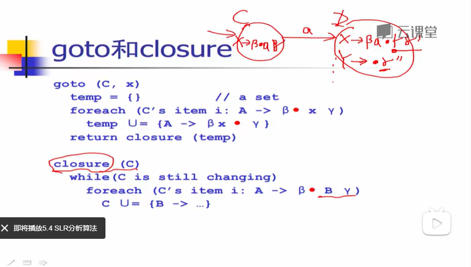

# 编译原理 #

> [中科大编译原理学习笔记](https://github.com/wangfupeng1988/read-notes/blob/master/video/%E7%BC%96%E8%AF%91%E5%8E%9F%E7%90%86.md)

- δ(delta)
- Σ(sigma)
- ε(epsilon)

## 编译器概述 ##

前端 + 后端

字符流 => **词法分析器** => 记号流 => **语法分析器** => 抽象语法树 => **语义分析器** => 中间标识

## 词法分析 ##

字符流 => **词法分析器** => 记号流

字符流：与被编译的语言相关

记号流：编译器内部的数据结构，编码所实现的词法单元

### 实现方案 ###

1. 手工编码方案
	- 复杂、容易出错
	- 主流的方案，如GCC，LLVM
2. 词法分析器的生成器
	- 快速原型、代码量少
	- 难控制细节

**转移图**

> 手工编码

**识别关键字和标识符**

1. 拓展转移图，逐个字母进行识别，从而识别关键字
2. 使用hash表存关键字

### 正则表达式 ###

> 自动编码

**正则表达式定义**

对于给定的字符集Σ={c1, c2, ..., cn}

1. 空串ε是正则表达式
2. 对于任意c∈Σ，c是正则表达式
3. 如果M和N是正则表达式，则以下都是正则表达式
	1. 选择 M | N = {M, N}
	2. 连接 MN = {mn, m∈M, n∈N}
	3. 克林闭包 M* = {ε, M， MM, MMM, ...}

C语言的标识符：以字母或下划线开头，后跟零个或多个字母、数字或下划线

正则表达式**语法糖**

1. [c1-cn] == c1|c2|...|cn
2. e+ == 一个或多个e
3. e? == 零个或一个e
4. ...

### 有限状态自动机（FA） ###

输入字符串 => **FA** => {Yes, No}

M = {Σ, S, q0, F, δ}

- Σ：字母表 
- S：状态集
- q0：初始状态
- F：终结状态集
- δ：转移函数

根据转移函数是否确定，区分NFA和DFA

通过状态转移表描述

状态/字符 | a | b
--- | --- | ---
0 | 1 | 0
1 | 2 | 1
2 | 2 | 2

## 词法分析器 ##

RE（正则） => **Thompson算法** => NFA => **子集构造算法** => DFA => **Hopcroft最小化算法** => 词法分析器代码

### Thompson算法 ###

基于对RE的结构做归纳

- 对基本的RE直接构造
- 对复合的RE递归构造

### 子集构造算法 ###

计算接收一个字符能够到达所有状态的集合

如接收a，可以直接到达n1，通过ε可以到达n2、n3、n4、n6、n6、n9

> a(b|c)*的NFA

**ε闭包的计算**

基于深度优先算法

	set closure = {};
	void eps_closure(x)
		closure += {x}
		foreach(y: x--ε-->y)
			if (!visited(y))
				eps_closure(y)

基于广度优先算法

	set closure = {};
	Q = [];
	void eps_closure(x)
		Q = [x];
		while(Q not empty)
			q <- deQueue(Q)
			closure += q
			foreach(y: 1--ε-->y)
				if(!visited(y))
				enQueue(Q, y)

**子集构造算法**
	
	q0 <- eps_closure(n0)
	Q <- {q0}
	workList <- q0
	while(workList != [])
		remve q from workList
		foreach(character c)
			t <- eps-closure(delta(q, c))
			D[q, c] <- t // 由q状态接收c可以到达的状态
			if(t not in Q)
				add t to Q and workList

### Hopcroft算法 ###

基于等价类的思想

	split(S)
		foreach(character c)
		if(c can split S)
			split S into T1, ..., Tk
	
	hopcroft()
		split all nodes into N, A // 初始划分为非接受状态和接收状态
		while(set is still changes)
			splie(S)

初始：{q0, q1, q2, q4}, {q3, q5}

e: {q0, q1}, {q2, q4}, {q3, q5}

e: {q0}, {q1}, {q2, q4}, {q3, q5}

### DFA代码表示 ###

DFA是一个有向图

**转移表**

使用二维数组表示

状态/字符 | a | b | c
--- | --- | --- | ---
0 | 1 | e | e
1 | e | 1 | 1

驱动代码

	nextToken()
		state = 0
		stack = []
		while(state != ERROR) // 最长匹配
			c = getChar()
			if(state is ACCEPT)
				clear(stack)
			push(state)
			state = table[state][c]
		while(state is not Accept) // 如果读取下一个字符到达ERROR状态，表明是最长匹配了，不停弹出
			state = pop()
			rollback()
**跳转表**

跳转表不需要维护上面的二维数组，一段代码处理一个状态的转移
	
	nextToken()
		state = 0
		stack = []
		goto q0
	q0:
		c = getChar()
		if(state is ACCEPT)
			clear(stack)
		push(state)
		if(c=='a')
			goto q1
	q1:
		c = getChar()
		if(state is ACCEPT)
			clear(stack)
		push(state)
		if(c=='b' || c=='c)
			goto q1

## 文法 ##

### 上下文无关文法 ###

- 正则文法 —— 0型
- 上下文文法 —— 1型
- 上下文有关文法
- 任意文法

**上下文无关文法G**是一个四元组：

G=（T, N, P, S）

T

非终结符：N={S, N, V}

终结符：T={s, t, g, w, e, d}

开始符号：S∈N

产生式集合P：X->b1b2...bn，X∈N，bi∈(T∪N)

S -> N V N

N -> s | t | g | w

V -> e | d

**推导**

给定文法G，从G的开始符号S开始，用产生式的右部替换左侧的非终结符；不断重复直到不出现非终结符，最终得到的串称为句子

最左推导：选择最左侧的符号进行替换

**分析树**

推导可以表达成树状结构，和所有的推导顺序无关

1. 内部节点代表非终结符
2. 叶子节点代表终结符
3. 后序遍历决定句子的含义

### 二义性文法 ###

给定文法G，如果存在句子S，有两颗不同的分析树，那么G为二义性文法

解决方案：文法的重写

本质是规定优先级

将原来的：

	E -> E + E | E * E | num | id 

重写为：

	E -> E + T | T
	T -> T * F | F
	F -> num | id

### 自顶向下分析 ###

语法分析：给定文法G和句子s，回答s是否能够从G推导出来？

算法思想：从G的开始符号出发，随意推导出某个句子t，比较t和s

需要用到回溯，效率较低

### 递归下降分析算法 ###

也称为预测分析

- 分析高效，线性时间
- 容易分析，方便手工编码
- 错误定位和诊断信息准确
- 广泛使用，如GCC 4.0、LLVM

算法思想：用向前看符号避免回溯，根据输入的符号进行选择，不在逐个尝试

- 对每个非终结符构造一个分析函数
- 用向前看符号指导产生式规则选择

## LL（1）分析算法 ##

从左向右读入程序，最左推导，采用一个前看符号，表驱动的分析算法

- 分析高效，线性时间
- 错误定位和诊断信息准确
- 开源工具，如ANTLR

**LL(1)分析表**

### FIRST集 ###

FIRST不动点算法，表示非终结符可以推出的终结符的第一个符号

	foreach (nonterminal N)
		FIRST(N) = {}
	
	while(some set is changing)
		foreach(production p: N->b1...bn)
		if(b1==a)
			FIRST(N)∪={a}
		if(b1==M)
			FIRST(N)∪=FIRST(M)

进一步考虑bi为空的情况

	NULLABLE= {}
	while(NULLABLE is still changing)
		foreach(production p: x->b)
			if(b==ε)
				NULLABLE∪={x}
			if(b==Y1...Yn)
				if(Y1∈NULLABLE&&...&&Yn∈NULLABLE)
					NULLABLE∪={x}

### FOLLOW集 ###

FOLLOW不动点算法，标识非终结符后面可以跟着什么符号

	foreach (nonterminal N)
		FOLLOW(N) = {}
	while (some set is changing)
		foreach (production p: N->b1...bn)
			temp = FOLLOW(N)
			foreach (bi from bn downto b1) 逆序
				if (bi == a)
					temp = {a} 如果是终结符，更新temp
				if (bi == M) 
					FOLLOW(M) ∪= temp
					if (M i not NULLABLE)
						temp = FISRT(M) 非终结符，但是不为空，更新temp
					else temp ∪= FISRT(M) 非终结符，但是可能为空，将M的开始字符添加到temp中
				

### FIRST_S集 ###

根据NULLABLE、FIRST和FOLLOW集合计算得到

	foreach (production p)
		FISRT_S(p) = {}
	calculte_FIRST_S(production p: N->b1...bn)
		foreach (bi from b1 to bn)
			if (bi == a)
				FISRT_S(p) ∪= {a}
				return ;
			if (bi == M)
				FISRT_S(p) ∪= FISRT(M)
			if (M is not NULLABLE)
				return ;
		FIRST_S(p) ∪= FOLLOW(N) 所有都是非终结符，且非终结符都可能为空	

最后推出LL(1)分析表，再根据改进的自顶向下分析进行文法分析

### LL(1)文法冲突 ###

LL(1)分析表中存在多个元素，也就是说可以用多个表达式推出

**消除左递归**

转为右边递归

	0: E -> E + T
	1:    | T
	2: T -> T * F
	3:    | F
	4: F -> n

得到：

	0: E -> TE'
	1: E' -> + TE'
	2:     | 
	3: T -> FT'
	4: T' -> * FT'
	5:     |
	6: F -> n

**提取公因子**

	0: X -> aY
	1: 	  | aZ
	2: Y -> b
	3: Z -> c

得到：

	0: X -> aX’
	1: X' -> Y
	2:     | Z
	3: Y -> b
	4: Z -> c

## 自低向下分析 ##

目前使用最广泛的一类

LR分析算法（移进-规约算法），读入字符看是否能通过产生式规约

- 高效
- 现成工具，如YACC...

**移进**一个记号到栈顶上，或者
**规约**栈顶上的n个符号（某个产生式的又不）到左部的非终结符

核心问题：如何确定移进和规约的时机

**LR0分析表**

**LR0分析算法**
	
	stack = []
	push($) end of file
	push(1)
	while (true)
		token t = nextToken()
		state s = stack[top]
		if (ACTION[s, t] == "si") 移进
			push(t); push(i)
		else if (ACTION[s, t] = "rj") 规约
			pop(the right hand of production "j: X->b")
			state s = stack[top]
			push(X); push(GOTO[s, X])
		else error

**LR0分析表构造算法**

## SLR分析 ##

存在移进和规约冲突

和LR(0)分析算法基本步骤相同，仅区别于对规约的处理，对于状态i的项目X->a*，仅对y∈FOLLOW(X)添加ACTION[i, y]

可以减少需要规约的情况，解决部分移进和规约冲突

但仍然有冲突出现的可能

## LR(1)分析 ##

广泛应用

[X->a*B, c]的含义是a在栈顶，剩余的输入就能够匹配Bc；当规约X->aB时，c是前看符号，bareduce by X->aB`填入ACTION[s, c]

## 语法制导的翻译 ##

编译器在做语法分析的过程中，除了回答程序语法是否合法，还需要

1. 类型检查
2. 目标代码生成
3. 中间代码生成

添加语义动作，语义动作在规约的时候执行

在分析栈上维护三元组:<symbol, value, state>，分别对应终结符/非终结符、symbol所拥有的值、当前的分析状态

### 抽象语法树 ###

分析树包含了所有的元素，因此包含了很多不必要的信息

抽象语法树对分析树进行浓缩

**具体语法**：语法分析器使用的语法，必须适合于语法分析，如各种分隔符、消除左递归、提取左公因子

**抽象语法**：表达语法结构的内部表示，现代编译器一般采用抽象语法作为前端和后端的接口

## 语义分析任务 ##

语义分析也称为类型检查、上下文相关分析

负责检查程序（AST）的上下文相关属性：

1. 变量在使用前先声明
2. 每个表达式都有合适的类型
3. 函数调用和函数的定义一致

再语法分析的基础上，输入语义表示验证是否符合语义要求

**类型检查**

### 符号表 ###

存储程序中变量相关信息，在规模大的时候要高效

1. 类型
2. 作用域
3. 访问控制信息

单表处理和多表处理作用域

单表：退出作用域删除局部符号

多表：进入作用域，创建新的符号表，退出删除符号表

每个名字空间用一个表来处理，名字空间如变量、标签、结构体类型、标号等

### 其他问题 ###

**类型相等**

判断两个变量类型是否相等

- 名字相等 vs 结构相等
- 面向对象的继承

**错误诊断**

准确给出错误信息和出错位置

在词法分析、语法分析、语义分析保留位置信息

**代码翻译**

负责生成中间表示和目标代码

编译器中最复杂的模块

## 代码生成 ##

翻译成目标机器上的代码

- 真实的物理机，x86、arm
- 虚拟机，jvm

两个重要任务

- 给源程序的数据分配计算资源
	1. 源程序的数据：全局变量、局部变量、动态分配等
	2. 计算资源：寄存器、数据区、代码区、栈区、堆区
	3. 为数据分配计算资源，变量应该放在内存李还是寄存器中？
- 给源程序的代码选择指令
	1. 源程序的代码：表达式、语句、函数等
	2. 机器指令：算数运算、比较、跳转、函数调用返回
	3. 用机器指令实现高层代码的语义：等价性、对机器指令集体系结构（ISA）的熟悉

### 栈式计算机 ###

由于效率问题，已经退出历史舞台，实现简单，但仍然应用于虚拟机，如jvm

**递归下降的代码生成算法**

...

**如何运行生成的代码**

- 真实的物理机
- 虚拟机，jvm
- 非栈式计算机模拟，x86可以模拟栈式计算机

### 寄存器计算机 ###

目前最主流的，效率高，系统架构规整，指令等长，如RISC

有寄存器，所有访存操作都需要通过load/store操作

- 内存：存放溢出变量
- 寄存器：运算空间，假设有无数个
- 执行引擎：执行指令

## 中间代码 ##

表示形式

1. 树和有向无环图（DAG）：高层表示，适用于源代码
2. 三地址码（3AC）：底层表示，靠近目标机器
3. 控制流图（CFG）：更精细的三地址码，适合做程序分析
4. 静态单赋值（SSA）：更精细的控制流图，同时编码控制流图和数据流图
5. 连续传递风格（CPS）：更一般的SSA

### 三地址码 ###

1. 给每个中间变量和计算结果命名，没有符合表达式
2. 只有基本的控制流图，没有各种控制结构，只有goto、call等
3. 抽象的指令集，通用的RISC

优点

1. 操作是原子的，没有复合结构
2. 简化控制流，只有跳转
3. 抽象的机器代码，向后做代码生成更容易

不足：控制流信息是隐式的

### 控制流图 ###

**基本块**：语句序列，只能从第一条指令进入，最后一条指令退出，不能从中间进入

**三地址码生成控制流图**

	List_t stms;
	List_t blocks = {};
	Block_t b = Block fresh();
	scan_stms()
		foreach(s∈stms)
			if(s is "Label L")
				b.label = L;
			else(s is some jump)
				b.j = s;
				blocks ∪= {b};
				b = Block_fresh();
			else
				b.stms ∪= {s};

### 数据流分析 ###

