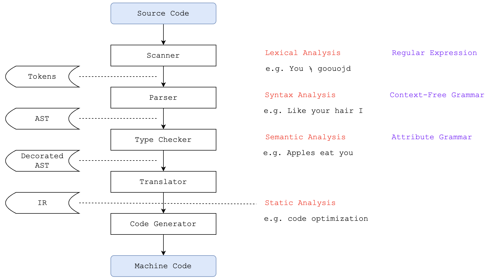
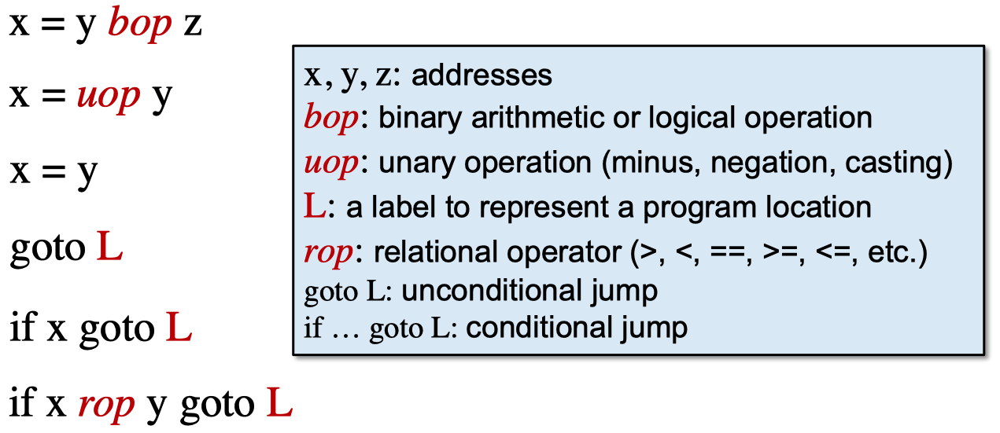
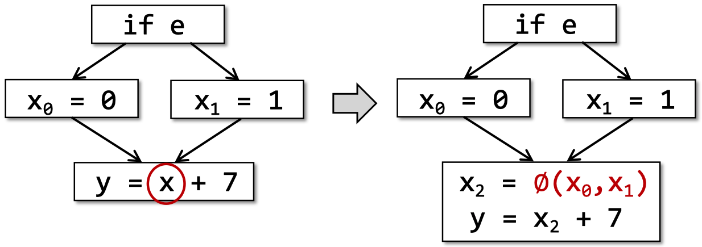
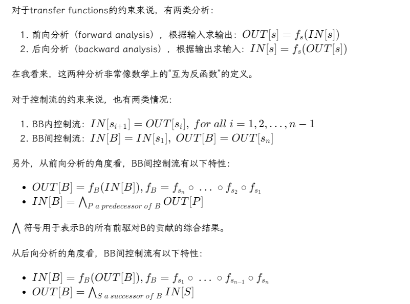

# 南京大学《软件分析》 #

# Intermediate Representation ##

Intermediate Representation，简称IR

## 编译器结构 ##

> 编译器通常包括词法分析、语法分析、语义分析等过程，最终生成机器码。

**文法**：包含0型文法（对应递归可枚举语言，图灵机）、1型文法（对应上下文敏感语言）、2型文法（对应上下文无关语言）和3型文法（正则文法，有限状态机）

### AST vs. IR ###

AST	| IR
--- | ---
层次较高，更接近语法结构 | 层次较低，更接近机器码
通常是语言紧密相关的 | 通常是语言无关的
适合用于快速类型检查 | 通常是简洁（compact）而统一（uniform）的
缺乏控制流信息 | 包含控制流信息
- | 通常用作静态分析的基础

### Three-Address Code ###

> Three-Address Code，简称3AC，在一个指令的右边至多只有一个操作符

### Static Single Assignment ###

> Static Single Assignment，简称SSA，在3AC的基础上，所有赋值操作的被赋值变量都需要有一个独特的名字

某个变量可能受到条件分支影响，处于控制流汇聚的位置（control flow merges），此时就需要使用φ函数来处理

优点 | 缺点
--- | ---
控制流信息可以间接融合到独特变量名中，帮助简化分析 | 可能引入过多变量和φ函数
Define-and-Use配对是明确清楚的 | 可能造成机器码生成效率低下

### Control Flow Analysis ###

> Control Flow Graph，简称CFG

**Base Blocks**：一个连续、最长的3AC序列
- 从该序列的最后一条指令退出

#### 划分BB ####

**确定3AC序列中的leaders**：

1. 3AC序列中的第一条指令
2. 所有有条件跳转或无条件跳转的所有目标指令
3. 所有有条件跳转或无条件跳转后面的一条指令

**划分BB**：BB包含leader指令及其后面紧邻的所有非leader指令。

# 数据流分析应用 #

## 数据流方程 ##

## Reaching Definitions Analysis ##

> A definition d at program point p reaches a point q if there is a path from p to q such that d is not “killed” along that path.

# 数据流分析基础 #

## 偏序（Partial Order） ##

偏序集poset定义为（P，≤），具有反身性、反对称性和传递性

上界和下界 => 最小上界和最大下界

## 格、半格、完全格和乘积格 ##

**格（lattice）**：偏序集并且任意两个元素的最小上界和最大下界都存在

**半格（semilattice）**：放宽了对格的定义；如果最小上界存在，则为join semilattice，相反为meet semilattice

**完全格（complete lattice）**：它的任意子集的最小上界和最大下界都存在

## 基于格的数据流分析框架 ##

基于格的数据流分析框架 (D,L,F)

- D：数据流方向，forwards or backwards
- L：值域V和一个meet或join操作符构成的格
- F：从V到V的转移函数

## 单调性（Monotonicity）和不动点（Fixed Point）定理 ##

**单调性**：对于函数f: L -> L (L is a lattice) 单调，对于x，y∈L，x≤y => f(x)≤f(y)

**不动点定理**：给定完全格（L，≤），如果f是单调且L是有限的，f的最小不动点可以通过不断迭代计算f（bottom），f（f（bottom））得到，最大不动点同理

- 根据不动点定理推导出来不动点的存在性
- 归纳证明不动点是最大/小不动点

> Q1：一定可以到达不动点吗？

> Q2：只有一个不动点吗？

> Q3：什么时候到达不动点？

### Meet-Over-All-Path Solution (MOP) ###

枚举所有Path，先计算根据transfer计算所有Path的结果，再计算Meet

Ours=F(xUy)

MOP=F(x)UF(y)

> MOP≤Ours

F单调，F(x)≤F(xUy) and F(y)≤F(xUy) => F(xUy)是F(x) and F(y)的上界

因为F(x)UF(y)是F(x) and F(y)的最小上界 => F(x)UF(y)≤F(xUy) => MOP≤Ours

# 过程间分析 #

## 函数调用图 ##

### Virtual Call ###

- Dispatch(c, m)=m' 如果class c包含跟m同名的非抽象方法m'
- Dispatch(c, m)=Dispatch(c', m) c'是c的父类

### Class Hierarchy Analysis (CHA) ###

## 指针分析 ##

1. 堆建模
2. 上下文敏感和上下文不敏感
3. 流敏感和流不敏感
4. 分析域，全程序分析和需求驱动分析